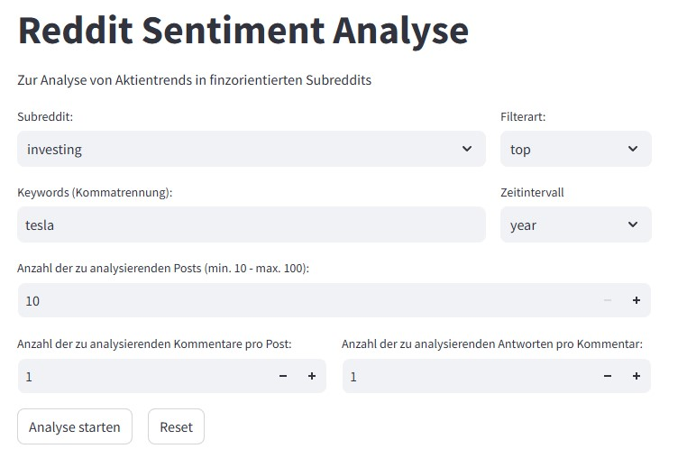

# Masterarbeit: Entwicklung eines KI-Systems zur Analyse der Börsenstimmung innerhalb der Nachrichtenplattform Reddit
## Ziel der Arbeit ist die Entwicklung eines vollumfänglichen KI-Systems, welches die Börsenstimmung in finanzorientierten Subreddits numerisch erfasst und in aggregierter Form ausgibt.

### Tools & Technologien:
- Python
- FineTuning mit OpenAI
- Microsoft Excel

### Projektstruktur
1. **Trainingsdaten** für den FineTuning Prozess generieren und formatieren 
2. **Beiträge durchsuchen** und an die Sentimentanalyse übergeben
3. **Numerische Verrechnung und Gewichtung** des Analyseoutputs im Backend
4. **Übermittlung an das Frontend** und Ausgabe der aggregierten Ergebnisse

### Key Learnings / Highlights
- Numerische Erfassung der Börsenstimmung durch individualisierte Sentimentanalyse und einer Buy-Sell-Intention mit OpenAI
- Aggregierte Daten schließen auf eine Korrelation zwischen Stimmung und Kursentwicklung

### Visualisierung
**Input:**

**Output:**

## Hinweis:
Die Trainingsdaten wurden mit der Standardversion von OpenAI "gpt-4o-mini" automatisch erfasst und beinhalten tatsächliche Reddit-Beiträge. Die Trainingsdaten wurden in einem vordefinierten Format als JSONL-Datei erfasst und unter festgelegten Entscheidungsregeln manuell angepasst, um die gewünschte Funktionsweise zu garantieren. Der in diesem Repository aufgeführte Algorythmus umfasst legiglich die finale Funktionsweise des KI-Systems, **ohne** das vorangegangene FineTuning des verwendeten GPT-Modells.
